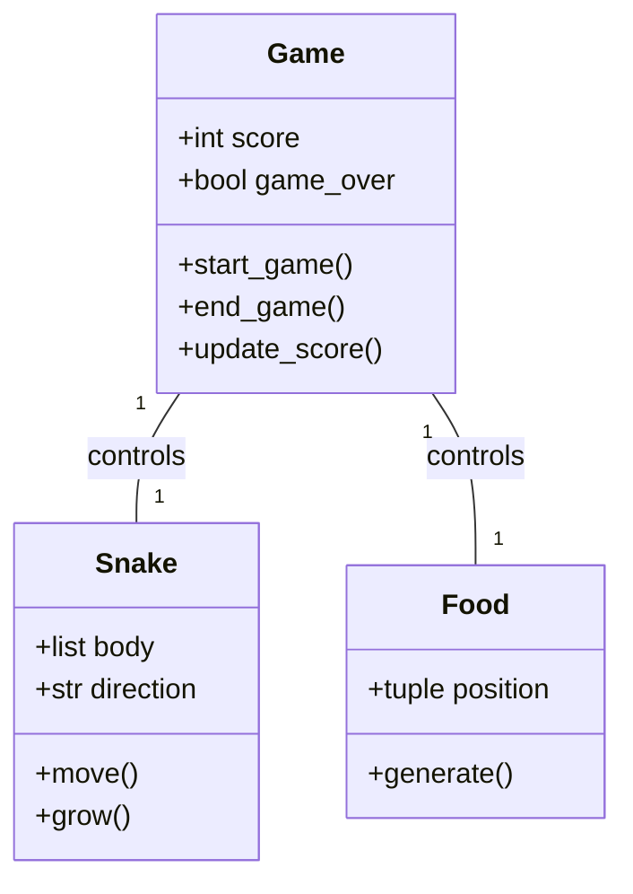
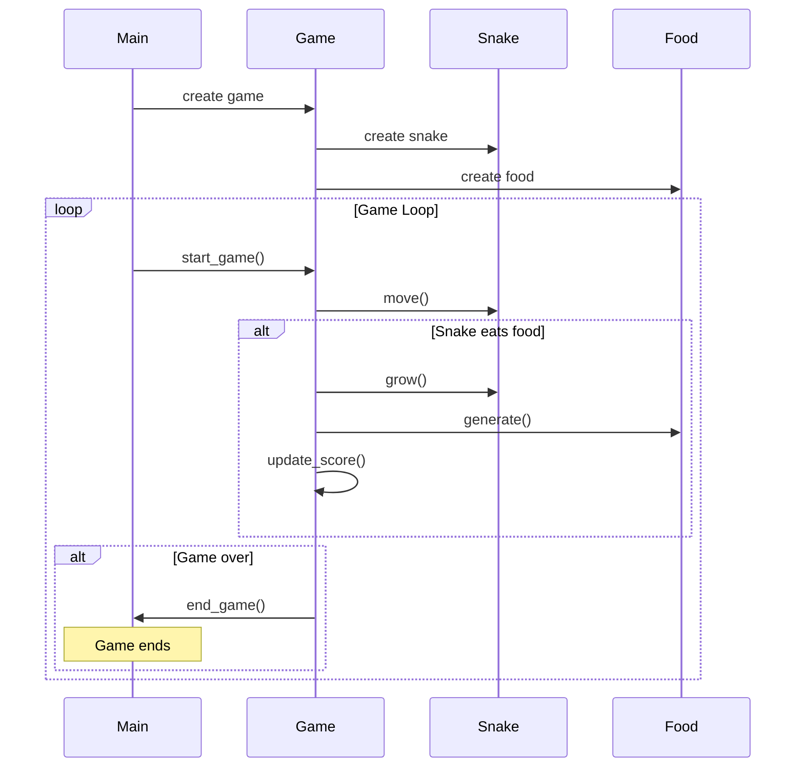

# CLI snake game analysis

## Command
python startup.py "Write a cli snake game"

## Original Requirements
The boss has requested the creation of a command-line interface (CLI) snake game.

## Product Goals
```python
[
    "Create a simple and engaging CLI snake game",
    "Ensure the game is easy to install and run",
    "Incorporate basic features like score tracking and game over conditions"
]
```

## User Stories
```python
[
    "As a user, I want to be able to easily start a new game, so that I can play whenever I want",
    "As a user, I want the game to track my score, so that I can see how well I'm doing",
    "As a user, I want a clear game over condition, so that I know when I've lost and can try again",
    "As a user, I want the game to run smoothly, so that I can enjoy playing without interruptions",
    "As a user, I want to be able to quit the game at any time, so that I can stop playing when I need to"
]
```

## Competitive Analysis
```python
[
    "Python Snake Game: A simple CLI snake game with basic features, but lacks a clear game over condition",
    "Java Snake Game: A more complex game with additional features, but requires Java installation and setup",
    "JavaScript Snake Game: Web-based game, easy to access but lacks the simplicity and speed of a CLI game",
    "C++ Snake Game: Fast and efficient, but requires knowledge of C++ to install and run",
    "Ruby Snake Game: Similar to our product, but lacks score tracking feature"
]
```

## Competitive Quadrant Chart


## Requirement Analysis
The product should be a CLI snake game that is easy to install and run. It should have basic features like score tracking and a clear game over condition. The game should run smoothly and allow the user to quit at any time.

## Requirement Pool
```python
[
    ("Implement a CLI interface for the game", "P0"),
    ("Develop a score tracking system", "P0"),
    ("Create a clear game over condition", "P0"),
    ("Ensure the game runs smoothly", "P0"),
    ("Allow the user to quit the game at any time", "P0")
]
```

## UI Design draft
The game will be a text-based CLI interface. The snake will be represented by a line of characters that moves around the screen. The score will be displayed at the top of the screen, and a game over message will appear when the game ends. The layout will be simple and clear, with easy-to-read text and a clean design.

## Anything UNCLEAR
There are no unclear points.

## Implementation approach
We will use Python's built-in libraries to implement the game. The `curses` library will be used to handle the command-line interface and user input. The game logic will be implemented in a `Game` class, which will handle the game state, score tracking, and game over conditions. The `Snake` and `Food` classes will represent the snake and food in the game, respectively. The game will be packaged using setuptools, allowing it to be easily installed and run.

## Python package name
```python
"cli_snake_game"
```

## File list
```python
[
    "main.py",
    "game.py",
    "snake.py",
    "food.py",
    "setup.py"
]
```

## Data structures and interface definitions


## Program call flow


## Anything UNCLEAR
The requirement is clear to me.

## Required Python third-party packages
```python
"""
curses==2.2
setuptools==57.4.0
"""
```

## Required Other language third-party packages
```python
"""
No third-party packages required.
"""
```

## Full API spec
```python
"""
No APIs are required for this project as it is a command-line interface game.
"""
```

## Logic Analysis
```python
[
    ("main.py", "Main entry point of the application. Responsible for creating and starting the game."),
    ("game.py", "Contains the Game class which controls the game state, score tracking, and game over conditions."),
    ("snake.py", "Contains the Snake class which represents the snake in the game. It should have methods for moving and growing the snake."),
    ("food.py", "Contains the Food class which represents the food in the game. It should have a method for generating food."),
    ("setup.py", "Responsible for packaging the game using setuptools.")
]
```

## Task list
```python
[
    "setup.py",
    "snake.py",
    "food.py",
    "game.py",
    "main.py"
]
```

## Shared Knowledge
```python
"""
'setup.py' is responsible for packaging the game using setuptools. This allows the game to be easily installed and run.
'snake.py' and 'food.py' represent the snake and food in the game, respectively. The snake can move and grow, while the food can be generated at random positions.
'game.py' controls the game state, including score tracking and game over conditions.
'main.py' is the main entry point of the application. It is responsible for creating and starting the game.
"""
```

## Anything UNCLEAR
The requirement is clear. The main point to consider is the order of task execution. The 'setup.py' should be created first to package the game. Then, the 'snake.py' and 'food.py' should be implemented to represent the snake and food in the game. After that, the 'game.py' should be implemented to control the game state. Finally, the 'main.py' should be created to start the game.

## Code: setup.py
```python
from setuptools import setup, find_packages

setup(
    name='cli_snake_game',
    version='1.0.0',
    description='A simple and engaging CLI snake game',
    author='Your Name',
    author_email='your.email@example.com',
    packages=find_packages(),
    install_requires=[
        'curses==2.2',
    ],
    entry_points={
        'console_scripts': [
            'cli-snake-game = cli_snake_game.main:main',
        ],
    },
    classifiers=[
        'Development Status :: 5 - Production/Stable',
        'Intended Audience :: End Users/Desktop',
        'Natural Language :: English',
        'Operating System :: OS Independent',
        'Programming Language :: Python :: 3.9',
    ],
)
```

## Code: snake.py
```python
import random

class Snake:
    def __init__(self):
        self.body = [(10, 10), (10, 9), (10, 8)]
        self.direction = "RIGHT"

    def move(self):
        """Move the snake in the current direction."""
        head = self.body[0]
        if self.direction == "UP":
            new_head = (head[0]-1, head[1])
        elif self.direction == "DOWN":
            new_head = (head[0]+1, head[1])
        elif self.direction == "LEFT":
            new_head = (head[0], head[1]-1)
        elif self.direction == "RIGHT":
            new_head = (head[0], head[1]+1)
        self.body.insert(0, new_head)
        self.body.pop()

    def grow(self):
        """Grow the snake by adding a new segment at the end of its body."""
        tail = self.body[-1]
        if self.direction == "UP":
            new_tail = (tail[0]-1, tail[1])
        elif self.direction == "DOWN":
            new_tail = (tail[0]+1, tail[1])
        elif self.direction == "LEFT":
            new_tail = (tail[0], tail[1]-1)
        elif self.direction == "RIGHT":
            new_tail = (tail[0], tail[1]+1)
        self.body.append(new_tail)

class Food:
    def __init__(self):
        self.position = (0, 0)

    def generate(self, snake_body):
        """Generate a new food item at a random position not occupied by the snake."""
        while True:
            x = random.randint(1, 20)
            y = random.randint(1, 60)
            if (x, y) not in snake_body:
                self.position = (x, y)
                break
```

## Code: food.py
```python
import random

class Food:
    def __init__(self):
        self.position = (0, 0)

    def generate(self, snake_body: list):
        """Generate a new food item at a random position not occupied by the snake."""
        while True:
            x = random.randint(1, 20)
            y = random.randint(1, 60)
            if (x, y) not in snake_body:
                self.position = (x, y)
                break
```

## Code: game.py
```python
import curses
from snake import Snake
from food import Food

class Game:
    def __init__(self, screen):
        self.score = 0
        self.game_over = False
        self.screen = screen
        self.snake = Snake()
        self.food = Food()
        self.food.generate(self.snake.body)

    def start_game(self):
        """Start the game loop."""
        while not self.game_over:
            self.screen.clear()
            self.screen.addstr(0, 0, f"Score: {self.score}")
            self.screen.addstr(self.food.position[0], self.food.position[1], "*")
            for segment in self.snake.body:
                self.screen.addstr(segment[0], segment[1], "#")
            self.screen.refresh()
            self.handle_input()
            self.update_game_state()

    def end_game(self):
        """End the game and display the game over message."""
        self.game_over = True
        self.screen.addstr(10, 30, "Game Over!")
        self.screen.refresh()
        self.screen.getch()

    def update_score(self):
        """Update the score."""
        self.score += 1

    def handle_input(self):
        """Handle user input."""
        key = self.screen.getch()
        if key == ord('q'):
            self.end_game()
        elif key == ord('w'):
            self.snake.direction = "UP"
        elif key == ord('s'):
            self.snake.direction = "DOWN"
        elif key == ord('a'):
            self.snake.direction = "LEFT"
        elif key == ord('d'):
            self.snake.direction = "RIGHT"

    def update_game_state(self):
        """Update the game state."""
        self.snake.move()
        if self.snake.body[0] in self.snake.body[1:]:
            self.end_game()
        elif self.snake.body[0] == self.food.position:
            self.snake.grow()
            self.food.generate(self.snake.body)
            self.update_score()
        elif self.snake.body[0][0] in [0, 21] or self.snake.body[0][1] in [0, 61]:
            self.end_game()
```

## Code: main.py
```python
import curses
from game import Game

def main():
    screen = curses.initscr()
    curses.curs_set(0)
    game = Game(screen)
    game.start_game()
    curses.endwin()

if __name__ == "__main__":
    main()
```